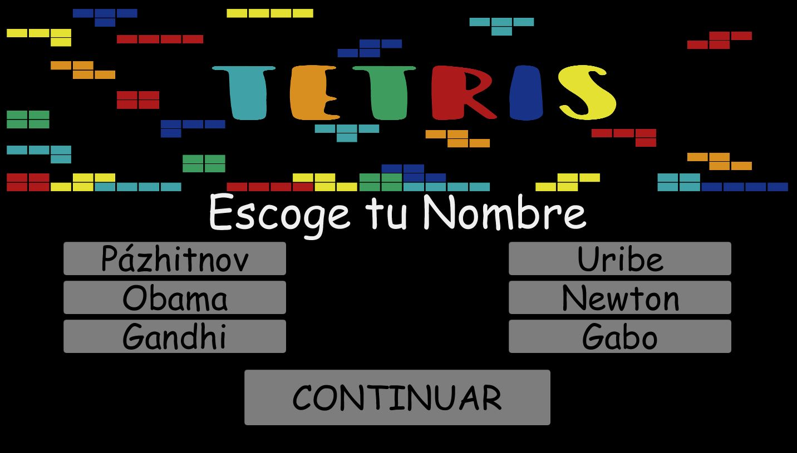
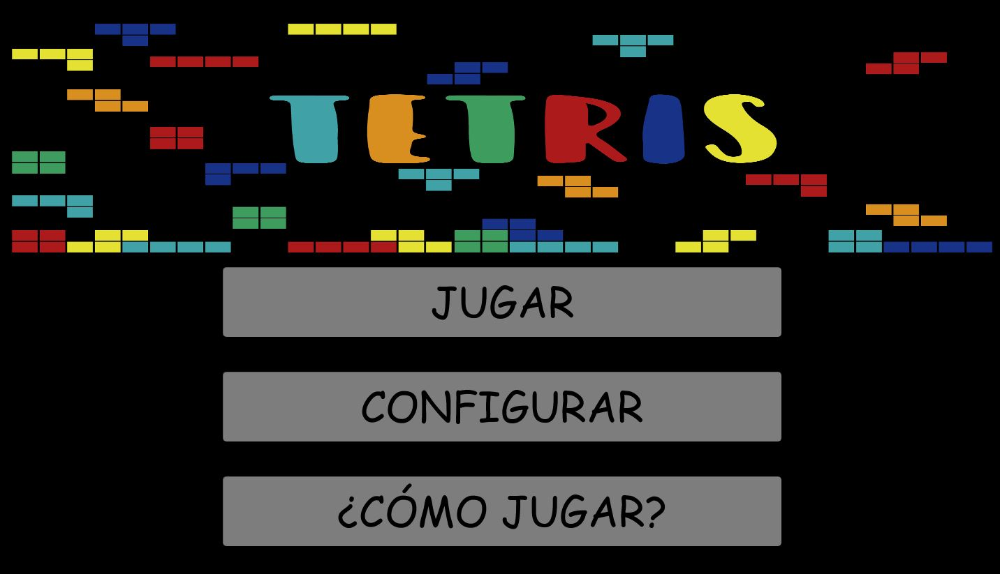
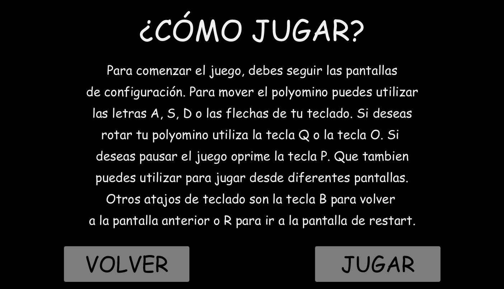
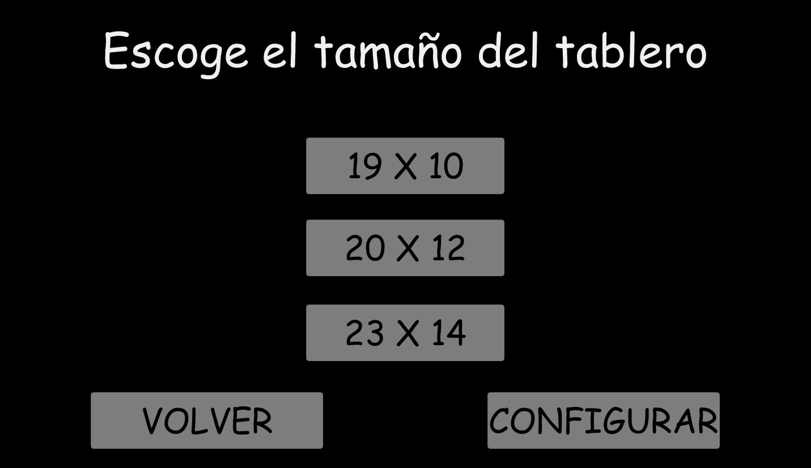
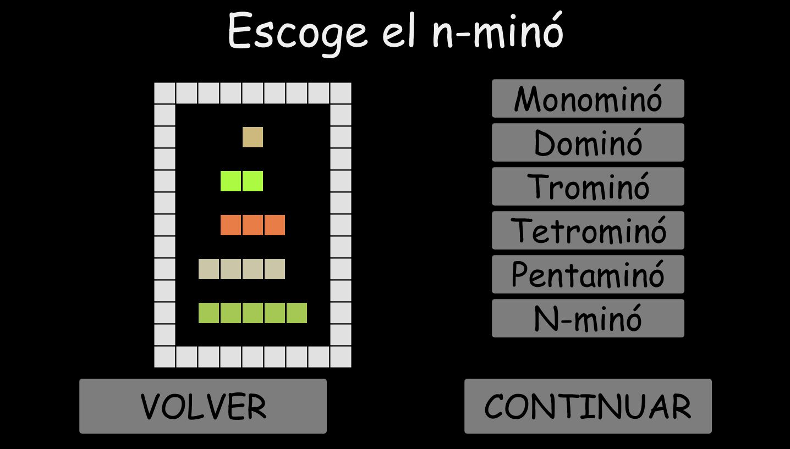
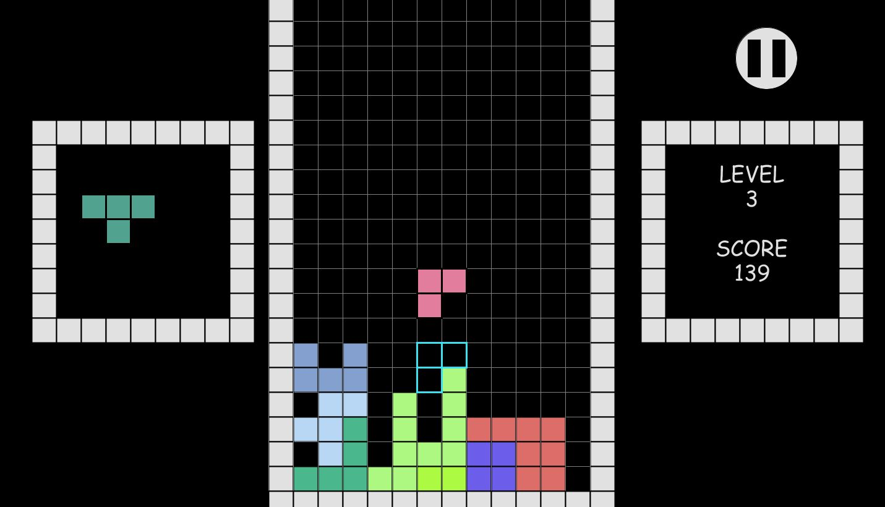
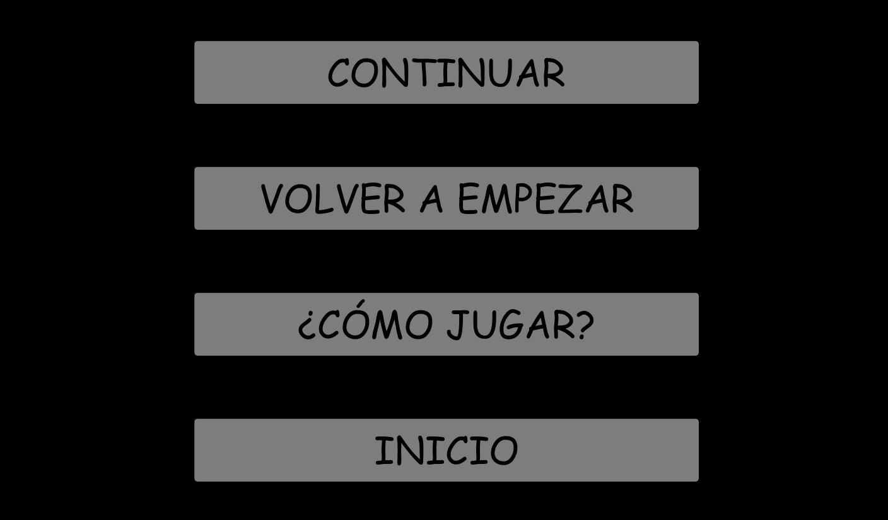
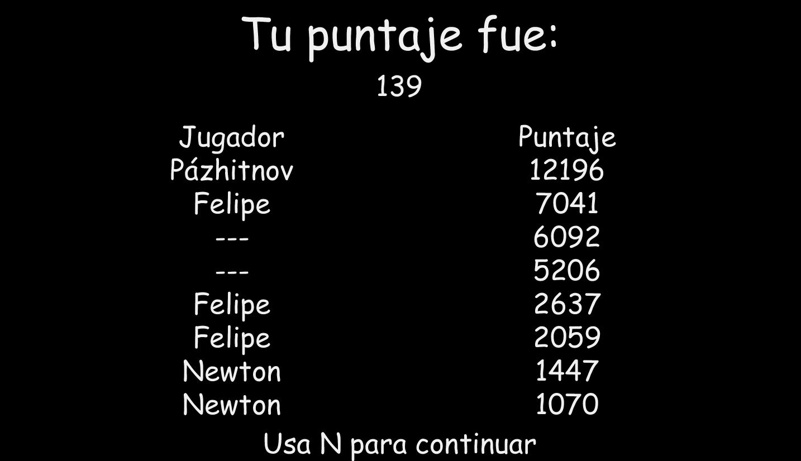

# :large_orange_diamond: Juego de Tetris :large_orange_diamond:
Autor: Andrés Felipe Forero Salas 

GitHub nickname: [fore1806](https://github.com/fore1806) 

Programación Orientada a Objetos

Universidad Nacional de Colombia Sede Bogotá

En el presente proyecto se pretende implementar la programación Orientada a Objetos para desarrollar un juego de tetris.

## Objetivo:

Emplear el paradigma de programación orientada a objetos para implementar uno o varios juegos basados en polyomines, como Pentomino pozzles o el tetris.

## Implementación:

Para el desarrollo de este juego de tetris, se comenzó por pensar sobre que clases debían ser creadas para desarrollar de buena manera el juego. En un primer momento se pensó en 3 clases, Button, Tetromino, Tablero, sin embargo, se analizó que cada una de ellas iba a tener algunos atributos en común, además de que todos los objetos de estas clases iban a ser desplegados; finalmente se observo que la clase Tetromino podia ser reemplazada por una mejor abstracción, la clase Polyomino. Así se plantea el proyecto con una clase Figure, que cuenta con los atributos posiciones en X y Y y colores de cuerpo y de borde. De esta clase heredan las tres clases mencionadas Polyomino, Tablero y Button

La clase Polyomino, cuenta con diversos atributos entre los que destacan rowy column, que es la fila y columna del tablero en el que se dibujará el polyomino, rotations, que es el vector de números que se emplean para mostrar, rotar, y evaluar colisiones del polyomino. Y numMono y numArray, que definen respectivamente el número de monominos del polyomino y el número de corrimiento en las operaciones bitwise.

En cuanto a métodos, se utilizan operaciones bitwise para dibujar y evaluar las posibles colisiones del polyomino. Además se utilizan los métodos savePolyomino para almacenar la figura cuando a dejado de moverse en la representación en memoria del tablero y el método polPosFinal que se encarga de evaluar donde se dibujará el polyomino al terminar de caer. Para mover el polyomino dentro del tablero basta con sumar o restar a los atributos de column, y row del mismo según se requiera. Para rotarlo se dibuja otro elemento del arreglo de enteros que define dichas rotaciones.

La clase de Tablero, cuenta con atributos de rows, columns, y dimCuadro que sumado a los atributos de la clase Figure, se utilizan para definir y dibujar cada tablero, mientras que los demás atributos de la clase tienen por objeto la funcionalidad de la eliminación de filas.

El método display, hace uso de la representación en memoria realizada durante el método inicialize, para mostrar en pantalla solo las posiciones del arreglo cuyo color es distinto de 0 (valor por defecto). Los métodos completedRows, deleteRows y addRows. Se describen por separado para dar mayor entendimiento a futuros programadores que desean utilizar este código como referencia. Sin embargo, se crea el método delete para condensarlos y facilitar su llamado dentro del main del código.

Finalmente la clase Button facilita el trabajo con botones, condensando su representación y utilización. La clase cuenta con dos métodos, a parte de su constructor, el primero es de tipo booleano permitiendo saber si sobre el se encuentra ubicado el mouse. Mientras que el segundo utiliza el método anteriormente descrito, para que en caso de que el mouse se encuentre sobre el botón, cambie el color del borde y el texto para que sea claro para el usuario que se encuentra posicionado sobre él.

Para el almacenamiento de los puntajes altos se utiliza un archivo en formato JSON. Para las demás funcionalidades del código se utilizan principios de programación estructurada funciones, ciclos y condicionales. Para organizar de mejor manera, estas funciones se encuentran en la pestaña de Funcionalidad.

Para la implementación de los scores ha sido indispensable la ayuda de Gabriel Bojacá [GabrielBojaca](https://github.com/GabrielBojaca). Para añadir sonidos al juego se utiliza la libreria de processing Sound, basandome en el video de YouTube de [curtis's channel](https://www.youtube.com/watch?v=DJJCci3kXe0). Por último el método para clonar objetos de la clase Polyomino, se utilizó la información proporcionada en una tutoría de la facultad de ingeniería.

## Conclusiones:

- Mediante el desarrollo de este proyecto se evidenció la importancia y utilidad de trabajar con las operaciones bitwise, como una representación de diferentes elementos en el desarrollo de un proyecto en programación.

- A través del uso de conceptos como la herencia, se logra abstraer el código de una mejor manera y ahorrar tiempo y esfuerzo a la hora de programar.

- Se evidenció que el paradigma de programación orientada a objetos permite la abstracción y facilita la creación de diversos modos de juego sin la necesidad de codificar varias veces lo mismo.

- Se encuentra que se deben combinar de buena forma los paradigmas de programación conocidos para no verse sesgado por alguno y de esta manera afectar la eficiencia de un programa.

## Instrucciones de Juego:

A continuación se presenta una pequeña guía de como jugar este Tetris, con la lectura de estas instrucciones conocerás los principales comandos de teclado que serán útiles a la hora de jugar. 

### Pantalla de Elección de Nombre:

Se comienza por escoger uno de estos nombres para almacenar tu puntaje en caso de que seas uno de los mejores 8 del juego.

### Pantalla de Inicio:

Esta es la pantalla inicial del juego, aquí puedes utilizar tu mouse para navegar entre las diferentes funcionalidades del proyecto.

### Pantalla de Como Jugar:

En esta pantalla se encuentran unas instrucciones básicas para poder jugar Tetris. Para navegar entre pantallas se debe utilizar el mouse.

### Pantallas de Configuración:

#### Pantalla de Configuración de Tablero:

En esta pantalla puedes escoger el tamaño del tablero entre las tres opciones propuestas. Usa tu mouse para navegar entre pantallas

#### Pantalla de Configuración de Polyominos:

En esta pantalla puedes escoger el tamaño de los polyominos. Si escoges la opción de n-minó, te saldrán polyominos de todos los tamaños.

#### Pantalla de Configuración de Colores:

En esta pantalla puedes escoger el color de los polyominos del tamaño de polyominos escogido. Para elegir los colores debes utilizar el mouse. En esta pantalla debe navegar con el teclado, siguiendo los atajos.

### Pantalla de Juego:

En esta pantalla el juego tiene lugar, en ella se observan el puntaje, nivel y el siguiente tetromino de la partida actual. Para jugar se utilizan los siguientes comandos

| Tecla |                               Atajo                            |
|-----  |----------------------------------------------------------------|
| S-Down|Mueve el tetromino una posición hacia abajo                     |
| A-Left|Mueve el tetromino una posición a la izquierda                  |
|D-Right|Mueve el tetromino una posición a la derecha                    |
|  Q-O  |Hace que el tetromino haga una rotación en sentido horario      |
|  W-I  |Hace que el tetromino haga una traslación en sentido horario    |
|   P   |Te lleva al menú de Pausa                                       |

#### Menú de Pausa

En el menú de Pausa se pueden realizar diferentes tareas, desde seguir jugando, pasando por recomenzar el juego y hasta ir a la pantalla de inicio. Para estas funcionalidades contamos con diferentes atajos de teclado.

|Tecla|                               Atajo                            |
|-----|----------------------------------------------------------------|
|  P  |Te permite continuar con la partida actual                      |

#### Pantalla de Mejores Puntajes

En esta pantalla se presentan los mejores puntajes obtenidos en el juego. Para seguir jugando o hacer uso de otras funcionalidades se debe oprimir la tecla N.

### Pantalla de Game Over

Esta pantalla solo se muestra una vez has perdido, en ella se observa tu puedes decidir que quieres hacer ahora.

Diviertete al máximo con mi juego :smiley: :v: :sunglasses: